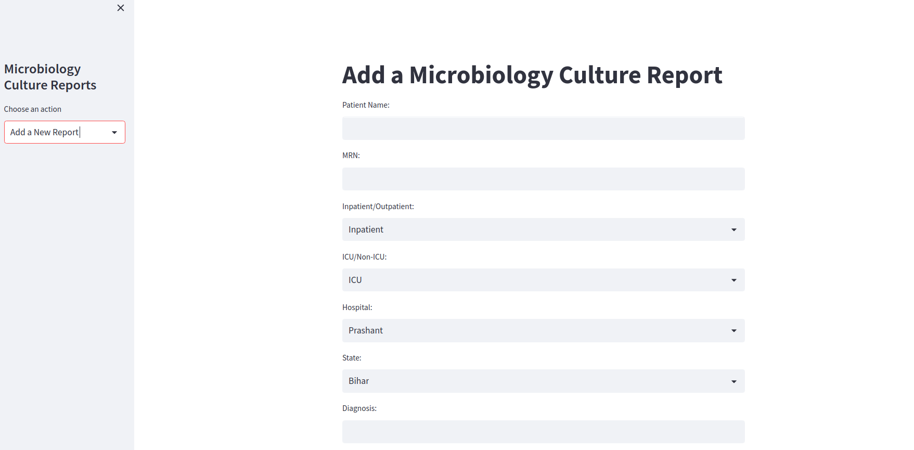

# Microbiology Culture Reports App

This Streamlit app allows users to manage microbiology culture reports. Users can add new reports, view existing reports, and manage antibiotic and hospital information.

 <!-- Replace 'screenshot.png' with the path to a screenshot of your app -->

## Features

- Add a new microbiology culture report with the following fields:
  - MRN
  - Inpatient/Outpatient
  - ICU/Non-ICU
  - Hospital
  - State
  - Diagnosis
  - Organism
  - Antibiotic sensitivity
  - Report date
- View existing reports
- Add new antibiotics and their classes
- Add new hospitals and their states

## Installation

### Prerequisites

- Python 3.7 or higher
- pip
- (Optional) virtual environment

### Steps

1. Clone this repository:
```
git clone https://github.com/yourusername/microbiology-culture-reports.git
cd microbiology-culture-reports
```

2. (Optional) Create and activate a virtual environment:

```
python -m venv venv
source venv/bin/activate # On Windows, use venv\Scripts\activate
```

3. Install the required packages:

`pip install -r requirements.txt`

4. Run the Streamlit app:

`streamlit run microbiology_app.py`

The app will open in your default web browser at `http://localhost:8501`.

## Usage

1. Choose an action from the sidebar:
- "View Reports"
- "Add a New Report"
- "Add a New Antibiotic"
- "Add a New Hospital"

2. Fill in the required fields and submit the form.

3. View the results or any feedback messages on the screen.

## Contributing

Pull requests are welcome. For major changes, please open an issue first to discuss what you would like to change.

Please make sure to update tests as appropriate.

## License

[MIT](https://choosealicense.com/licenses/mit/)
